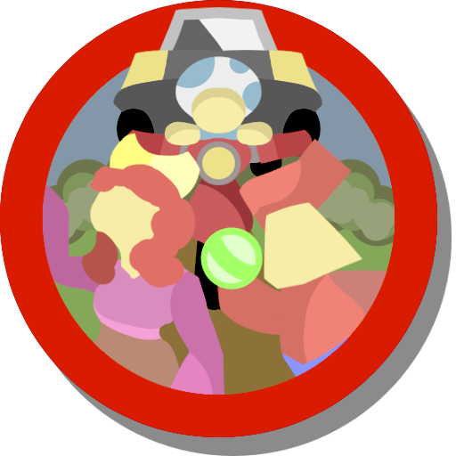

# Majija: Racing Friends

## Intro

Initially, game was developed for [`Yandex Games`](https://yandex.ru/games/app/330216) service, but game is not success, so the sources were published.

This is **Yandex Games** version and can **not** be built for *PC* and *Mobile*. For `Native Adaptation` version, see `native_release` branch and notice that this version can be built for native platform.

## Trailer

Trailer in Russian Language.

## Description

Majija Racing Friends is an exhilarating racing game set in a magical world where you are to compete with the islanders, experience the madness of speed, and become the king of this amazing place.

Together with your princess, you will participate in races, trying to defeat the local inhabitants. Stones of Chaos — insane bonuses that give power and might to their owner, will assist you in this. However, be cautious, as the enemies also use these stones.

### Game features:
- a crazy mix of nitro-speed and karting;
- 4 unique levels;
- “chaos” control;
- dynamic gameplay;
- vibrant 2D graphics with frame-by-frame animation;
- original music.

## Technical details

- Game was made with Unity 2021.3.37f1;
- Game development took 3 months;
- Game was made by one man;
- Borrowed resources:
    - FX sounds (They were heavely redesigned before usage);
    - Main Font (CutOutOfFont).

## Contact info

If you have any suggestions, questions or you just want to chat &mdash; feel free to ask! You can do it directly through *GitHub*, or with *PublicDevelMail@yandex.ru* email address.

Kozlov Egor, your developer.